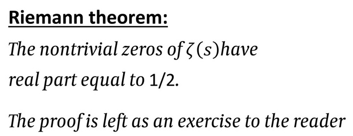
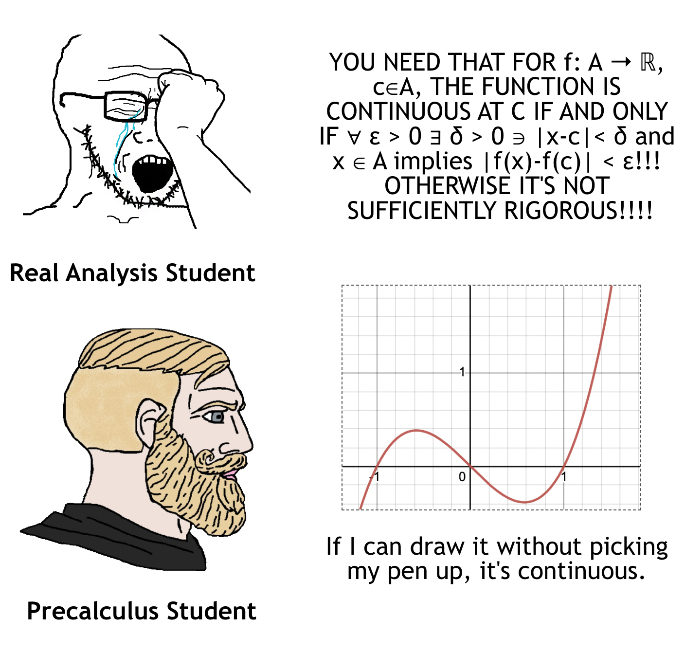
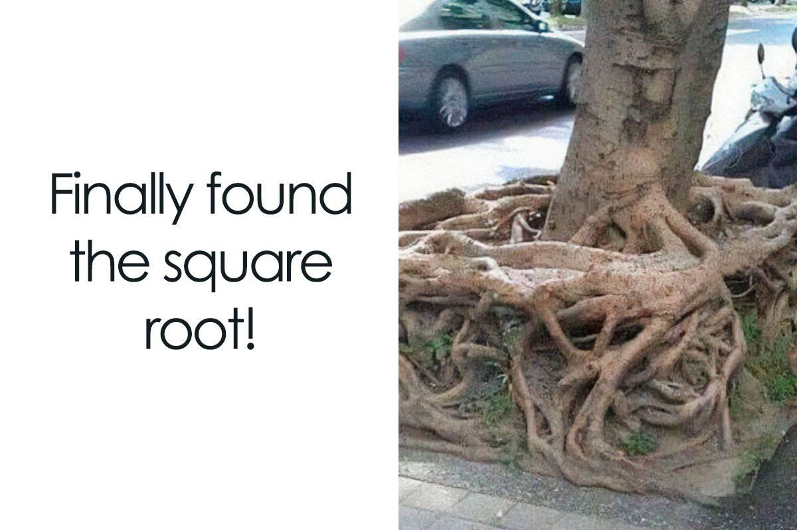
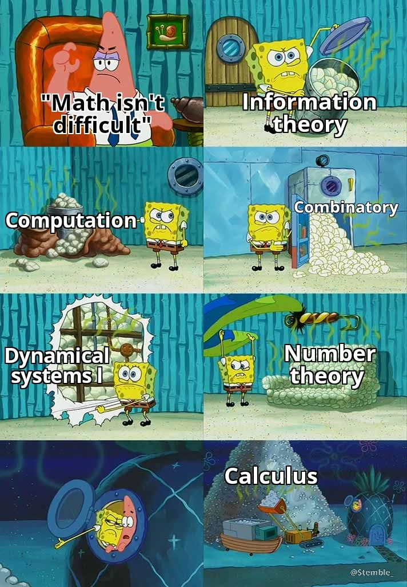
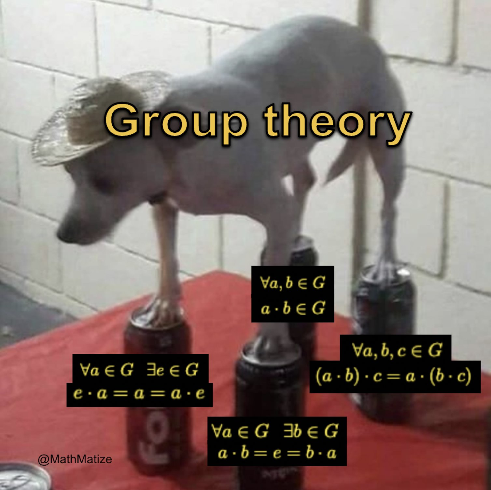
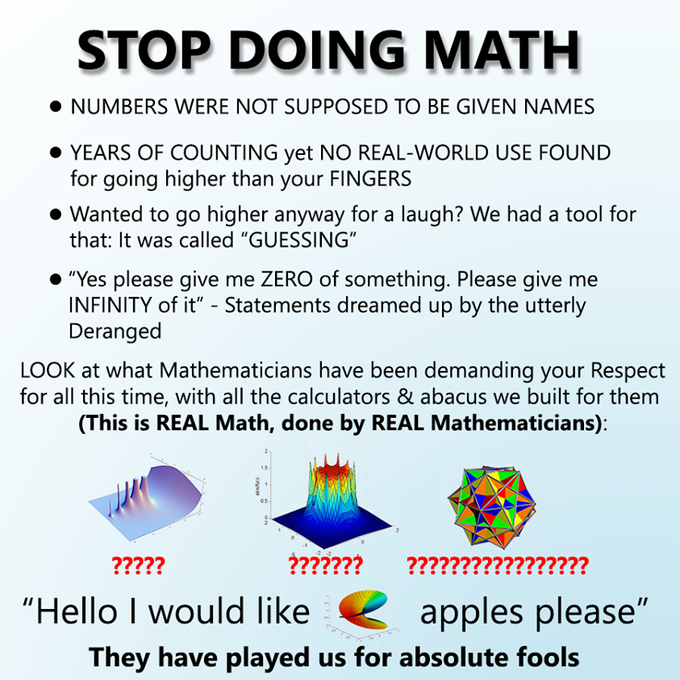

# Hi I'm h-alice

👋 **Hello there!**

I'm h-alice, a computer scientist, opensource developer. 🚀

### 🌱 Interests:
- 🤖 Artificial Intelligence & Machine Learning
- 🔐 Cryptography & Number Theory
- 📐 Geometry, Algebra and other Mathematics stuff.
- 🌀 Some **very cool** stuff like String Theory, Quantum Computing.
- 🌟 Opensource projects and contributing to the community.

### 💼 Capabilities:
- **Languages:** *Almost* all commonly used languages, expert in Python, C++ and GoLang.
- **Frameworks & Libraries:** Pytorch, TensorFlow
- **Tools & Platforms:** Git, Docker, Linux-based server managements

### 📫 Connect with me:
- 🌐 Website: [halice.art](https://halice.art)
- 📧 Email: admin@halice.art
- 🐦 Twitter: [@halice_art](https://twitter.com/halice_art)

### 🌟 Highlighted Projects

### 💬 Languages:
- Mandarin (Native)
- English (Fluent)
- Japanese (Intermediate)
- Binary (*4E 61 74 69 76 65*)

Oh, I also do doujin arts, I bet you can't find me.

# GitHub Stats

  

# Garbages

The compound-of-five-cubes is just too cute.